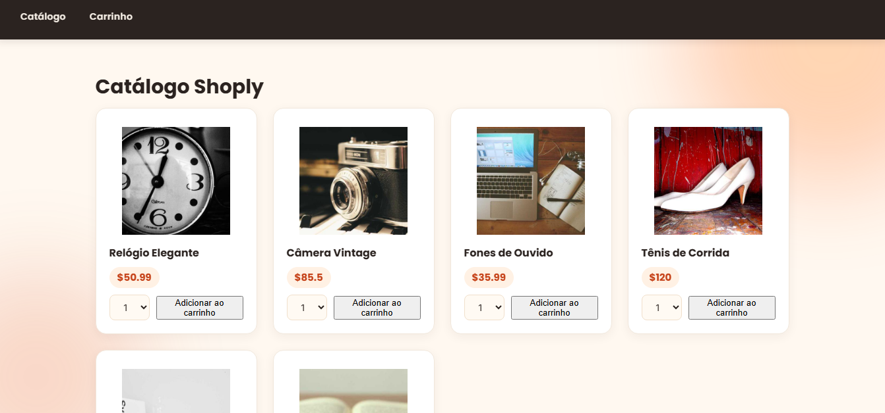

# 🛍️ ShopLy

O **ShopLy** é um e-commerce desenvolvido com **React.js**, simulando uma loja virtual que oferece produtos de diversas categorias. O projeto permite navegar pelos produtos, visualizar detalhes, adicionar itens ao carrinho e finalizar uma compra de forma simples, proporcionando uma experiência semelhante à de uma loja online.

## 📸 Preview



---

## 🚀 Funcionalidades

🛒 Listagem de produtos de diferentes categorias  
🔍 Visualização de detalhes dos produtos  
➕ Adicionar produtos ao carrinho  
➖ Aumentar e diminuir a quantidade de itens  
🗑️ Remover produtos do carrinho  
💰 Cálculo automático do valor total da compra  
📱 Interface moderna e responsiva

---

## 🛠️ Tecnologias Utilizadas

- React.js
- JavaScript (ES6+)
- HTML5
- CSS3
- Vite

---

## ⚙️ Como executar o projeto

### Clone o repositório

```bash
git clone https://github.com/seu-usuario/shoply.git
```

### Acesse a pasta do projeto

```bash
cd shoply
```

### Instale as dependências

```bash
npm install
```

### Execute o projeto

```bash
npm run dev
```

A aplicação estará disponível em:

```
http://localhost:5173
```

---

## 📖 Aprendizados

Durante o desenvolvimento deste projeto foram praticados conceitos como:

- Componentização com React
- Hooks (useState)
- Gerenciamento de estado
- Manipulação de eventos
- Renderização dinâmica de listas
- Props entre componentes
- Organização de componentes
- Carrinho de compras
- Estilização com CSS
- Estruturação de um e-commerce

---

## 👩‍💻 Autora

Desenvolvido por **Gabriela Romano**.
